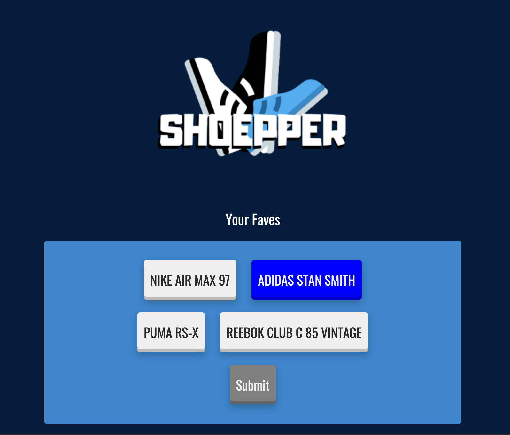
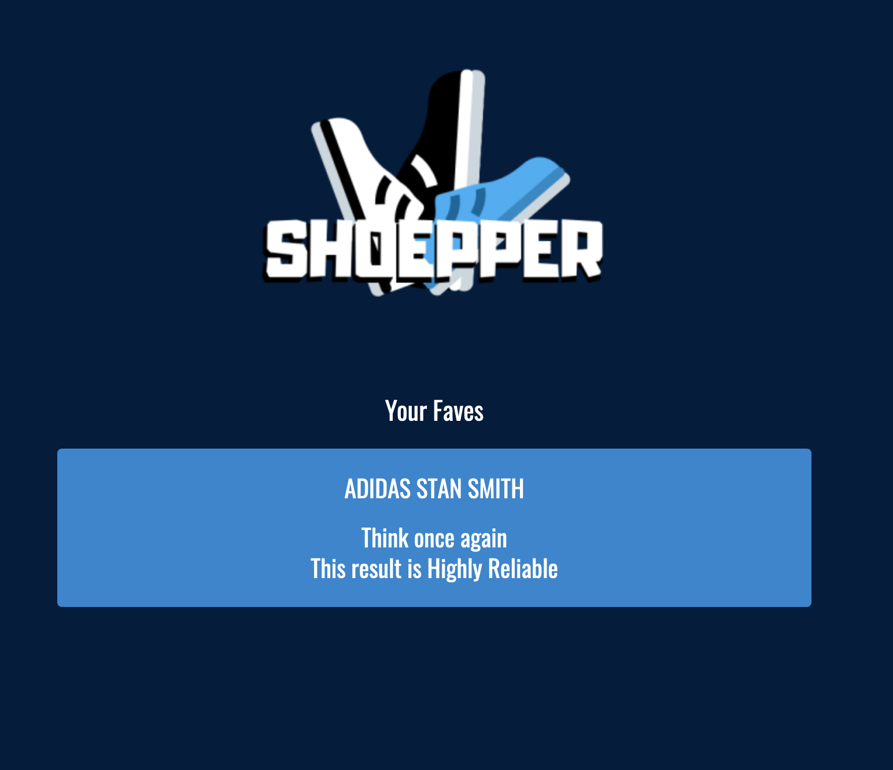

# Shoepper
EC601 A2 | Mini Project 1

Contributors: Toluwaleke Olutayo, Shineun Yoon

## Product Mission

### Target User(s)

* Customers
* Shoe Manufacturers
* Select shop owners (directors)

### User Stories

1. I, as user, would like to find Likes/Dislike of the certain product
1. I, as user, would like to know the specific details on the size of the product (ex, runs small, runs big, and etc.) 
1. I, as user, want to know the list of products that are popular among people on social media, especially Twitter.
1. I, as user, want to know the options on the color of the product.
1. As an user, I would like to keep updated with information on new or limited time products.
1. As a director of the Nike (likely to be changed to Shoe Company), I need to know the fashion trends of the shoes.
1. As a director of the Nike, I need to find the Likes/Dislikes of the certain product to give an insight of the way of changes.
1. As a director of competitor firm, I need to know strengthes and weakness of the product for the further improvements.

### MVP

The App is designed to be used by shoe retailers to track user reviews of brands/models of shoes. Also, the App would be able to potentially measure enthusiasm about a certain product before release. The system design for this App is broken into two major components:

  * Twitter Listing on the Certain Search Keyword
  * Sentiment Analysis on the Certain Product
    
 The first component involves accessing  and providing tweets via the Tweepy API that contain a certain keyword or hashtag obtained from the user. The user can also specify the desired number of tweets required. The second component involves performing a sentiment analysis on the received tweets using the google natural language API and then outputting an overall sentiment score to the user. 
 

### User Interface Design for main user story if required

In the beginning of this project, this application was intended to obtain a large selection of shoe product. However, there wasn't enough time to learn and build a database to work on Flask. Therefore, our app ended up having few choices. These choices were implemented as a button, in order for user to analyze easily in visually attractive way.
Moreover, the app includes responsive design, which led user to access anywhere on their smartphone and the computers.

## System Design and how your design addresses your user stories.

## READM of how to build your system.

1. Run the /Miniproject1/main.py on the terminal
2. From http://127.0.0.1:5000, it is possible to see the app running

## Testing
### Test document providing how each test case addresses the user stories
### Result of testing (screen shots, etc.)

[Main Page]

Using buttons, the user can select the item that he/she wants to see the overall review on

[Analysis Result]

With Sentimental Analysis, this application analyses the reliability.

## Lessons learned
### What you liked doing?
* Building a connection between modules
* Had a chance to learn how to use Flask

### What you could have done better?
* Printing actual user reviews on the website
* Develop a database to obtain a large data set to get more accurate results

### What you will avoid in the future?
* Push changes before changing the branch

